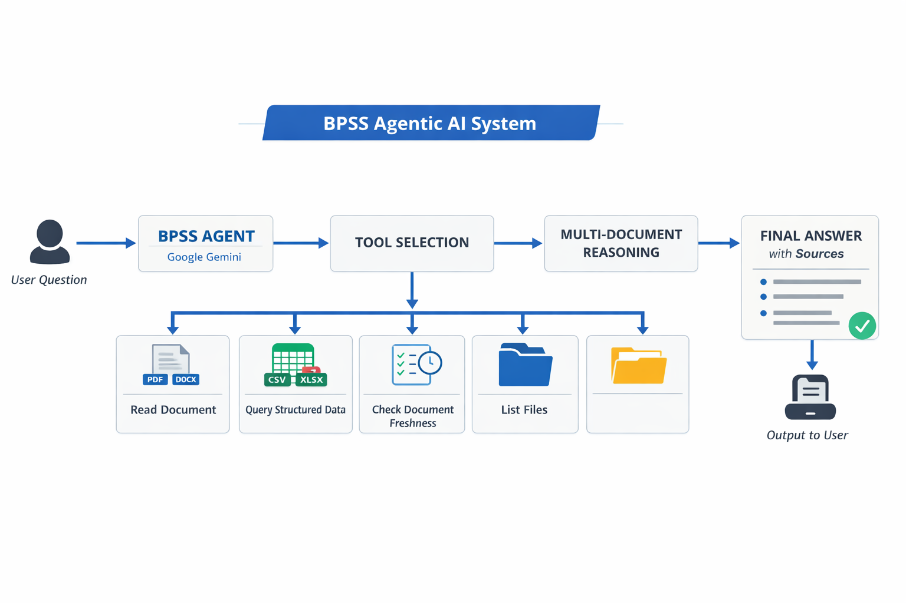

# 🧠 BPSS Agentic AI System

An AI-powered compliance analysis agent that answers complex questions over multi-format enterprise datasets (PDF, DOCX, CSV, XLSX) using a tool-augmented reasoning approach.

---

## 🚀 Overview

This project simulates a real-world enterprise screening system where data is distributed across multiple sources.

The system:

- Understands natural language questions  
- Identifies relevant data sources dynamically  
- Retrieves information from multiple file formats  
- Performs multi-step reasoning across documents  
- Produces accurate, auditable answers with evidence  

---

## 🏗️ System Architecture



### Flow

```
User Question
      ↓
BPSS Agent (LLM)
      ↓
Tool Selection
      ↓
Data Retrieval (PDF / DOCX / CSV / XLSX)
      ↓
Multi-document reasoning
      ↓
Final Answer with Sources
```

---

## 🛠️ Features

- Multi-format support (PDF, DOCX, CSV, XLSX)  
- Tool-based dynamic retrieval  
- Policy-driven reasoning (BPSS rules)  
- Contradiction detection  
- Source-level citations (`[SOURCE:]`)  
- Interactive + batch execution  

---

## 🔧 Tools

| Tool | Description |
|------|------------|
| read_document | Extracts text from PDF and DOCX |
| query_structured_data | Queries CSV/XLSX |
| check_document_freshness | Validates 90-day rule |
| list_files | Lists available files |

---

## 📂 Project Structure

```
.
├── agent.py
├── data/
│   ├── *.pdf
│   ├── *.docx
│   ├── *.csv
│   └── *.xlsx
├── system_diagram.png
├── requirements.txt
└── README.md
```

---

## ⚙️ Setup Instructions

### 1. Clone Repository

```bash
git clone https://github.com/MANOJ9902/BPSS-Agentic-AI-System.git
cd BPSS-Agentic-AI-System
```

---

### 2. Create Virtual Environment

```bash
python -m venv venv
```

---

### 3. Activate Virtual Environment

**Windows (PowerShell):**
```bash
venv\Scripts\activate
```

**Windows (CMD):**
```bash
venv\Scripts\activate.bat
```

**Mac / Linux:**
```bash
source venv/bin/activate
```

---

### 4. Install Dependencies

```bash
pip install -r requirements.txt
```

---

### 5. Install Pandoc

**Mac:**
```bash
brew install pandoc
```

**Ubuntu:**
```bash
sudo apt install pandoc
```

**Windows:**  
https://pandoc.org/installing.html

---

### 6. Set API Key

**Linux / Mac:**
```bash
export GEMINI_API_KEY="your_api_key_here"
```

**Windows (PowerShell):**
```bash
setx GEMINI_API_KEY "your_api_key_here"
```

---

### 7. Add Dataset

Place files inside:

```
./data/
```

Supported formats:

- PDF  
- DOCX  
- CSV  
- XLSX  

---

## ▶️ Usage

### Interactive Mode

```bash
python agent.py
```

---

### Ask Single Question

```bash
python agent.py --ask "Which candidates are not ready for BPSS closure?"
```

---

### Batch Mode

```bash
python agent.py --batch
```

Output:

```
bpss_answers.md
```

---

## 💡 Example Questions

- What are the compliance issues?  
- Which records violate policies?  
- Identify missing information  
- Summarize findings  

---
